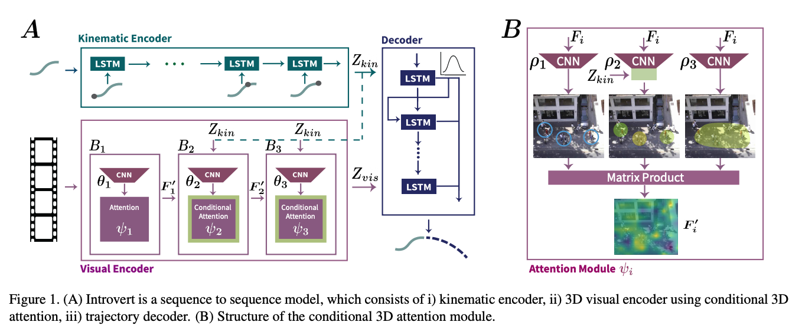

# Introvert: Human Trajectory Prediction via conditional 3D attention

## Overview
This repository contains the implementation of [Introvert: Human Trajectory Prediction via conditional 3D attention](https://openaccess.thecvf.com/content/CVPR2021/papers/Shafiee_Introvert_Human_Trajectory_Prediction_via_Conditional_3D_Attention_CVPR_2021_paper.pdf).
> In this work, we propose Introvert, a model which predicts human path based on his/her observed trajectory and the dynamic scene context, captured via a conditional 3D visual attention mechanism working on the input video. 



## Notes
```
The repository is still under construction.
Please let me know if you encounter any issues.

Best,
Nasim Shafiee

shafiee [dot] n [at] northeastern [dot] edu
```

---
## Prerequisites
To install all the dependency packages, please run:
```
pip install -r requirements.txt
```


---
## Data Preparation
We use UCY[1](https://onlinelibrary.wiley.com/doi/pdf/10.1111/j.1467-8659.2007.01089.x?casa_token=2iZc5PYbMJwAAAAA:q2HXsiicR9iJJSQqPK00iQiXdAzshm16u5dkkp46RKSEn5mWAdGVYQECebhrvTaPoBbtjkdEwjRv5YLu) and ETH[2](https://ieeexplore.ieee.org/iel5/5453389/5459144/05459260.pdf?casa_token=vSn3LxoiZ9wAAAAA:WvPT7mzK5eeAsMhS3vRdnVWTbhtpTrZv4e2nzszjKDj1hnTEfGkdkyZQNGbX-DcFvF11iLP069k) dataset. Please download and extract information into the `./data_trajpred folder`. [Click on here to download data](https://drive.google.com/drive/folders/1REq_if6nqdjw_jYtuRVPJqmDNTcIxoJU?usp=sharing) 

Now, in traj_pred.py find "# DataBase Variables" and update the data_traj_pred path.


---
## Training and Testing 
To run the code:
```
cd codes
CUDA_VISIBLE_DEVICES=0 python traj_pred.py --dataset="zara_01"
CUDA_VISIBLE_DEVICES=0 python traj_pred.py --dataset="zara_02"
CUDA_VISIBLE_DEVICES=0 python traj_pred.py --dataset="university"
CUDA_VISIBLE_DEVICES=0 python traj_pred.py --dataset="eth"
CUDA_VISIBLE_DEVICES=0 python traj_pred.py --dataset="hotel"
```


---
## Citation
If you find the project helpful, we would appreciate if you cite the works:
```
@inproceedings{shafiee2021introvert,
  title={Introvert: Human trajectory prediction via conditional 3d attention},
  author={Shafiee, Nasim and Padir, Taskin and Elhamifar, Ehsan},
  booktitle={Proceedings of the IEEE/CVF Conference on Computer Vision and Pattern Recognition},
  pages={16815--16825},
  year={2021}
}
```


---
## References
[1] Lerner, Alon, Yiorgos Chrysanthou, and Dani Lischinski. "Crowds by example." Computer graphics forum. Vol. 26. No. 3. Oxford, UK: Blackwell Publishing Ltd, 2007.
[2] Pellegrini, Stefano, et al. "You'll never walk alone: Modeling social behavior for multi-target tracking." 2009 IEEE 12th international conference on computer vision. IEEE, 2009.

